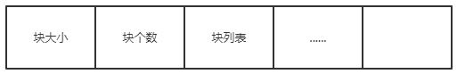
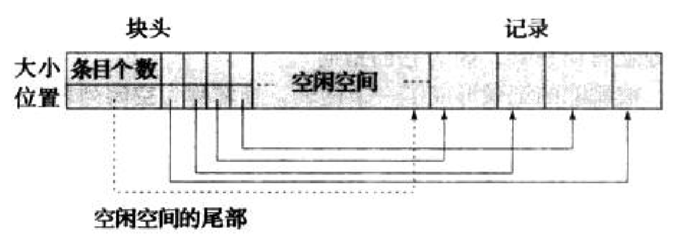
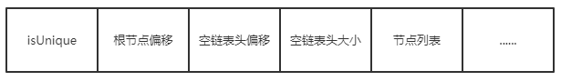
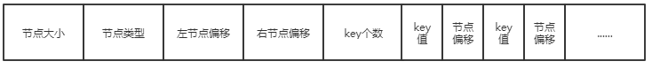
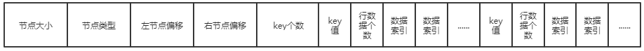

# OFADB设计文档

## 开发者

* 林灏
* 秦睿

## 	存储模块设计

我们将数据文件分为索引文件和数据文件两类，索引文件用于存储索引数的结构，数据文件用于存储数据库中实际的行数据. 实现的功能包括:

* 多种数据类型的持久化存储,包括int,short,long,double,float,string,bool.
* 记录数据的增删改查
* 行数据的高速缓存
* 索引树的部分更新
* 自定义的二进制文件格式存储数据,数据文件——.data, 索引文件——.ndx

### 数据文件组织方式

将数据存在多个大小相等并且较小的块(block)中，文件主体由block的列表构成，文件头存储文件中块的大小、块的数量。

* 块个数
* 块大小
* 块列表

####　记录存储格式

##### 单条记录需要存储的内容

* 空位图（用bit表示某个属性是否为null，1为null，该属性位置上存储内容无效）
* 变长字段记录内偏移量、长度
* 定长字段的值
* 变长字段的值

例：

|       |      | 空位图 | 变长字段偏移、长度1 | 变长字段偏移、长度2 | 定长字段1 | 定长字段2 | 变长字段1 | 变长字段2 |
| ----- | ---- | ------ | ------------------- | ------------------- | --------- | --------- | --------- | --------- |
| 值    |      | 0100   | （21，2）           | （23，4）           | 12        | null      | “he”      | "jack"    |
| bytes |      | 4-4    | 5-8                 | 9-12                | 13-16     | 17-20     | 21-22     | 23-26     |

#### 块组织存储格式（分槽的页结构） 

采用变长数据的存储方式——分槽的页结构，结构如下图所示，在块头部存储块的元数据。具体存储结构见下文：

##### 单个块存储结构

* 块大小
* 已经存储的记录个数
* 空闲位置指针
* 空闲空间大小
* 记录条目数组（块内偏移、大小）
* 记录数组

##### 块内数据操作

###### 删除方式

* 如果不是最后一条条目，则将对应记录的条目置为（-1，-1），否则回收条目的空间，
* 将对应索引后的所有记录依次后移
* 更新记录个数、空闲位置指针、空闲位置大小，因为单个块的大小不大，所以移动的代价相对变小。

###### 插入方式

* 如果条目列表中有空闲条目,则直接使用空闲条目,否则新建条目
* 将数据写入块中,并更新条目上的偏移和大小

###### 更新方式

* 如果更新后的数据大小变小，则将其后的记录后移相应位置，并更新对应条目的值；

* 如果更新后的数据大小变大，则对原数据执行删除操作后对新数据执行插入操作；

#### 文件数据的操作

##### 插入方式

遍历块的数组，

* 找到第一个可以插入的块（剩余大小足够大），在空闲位置指针处新建一个对应记录，更新空闲位置指针、记录条目数组、记录个数、空闲大小

* 如果没有可以插入的块，就新建一个块，然后插入

##### 删除方式

* 找到待删除的块
* 执行块内删除

##### 更新方式

* 检查当块是否可以容纳更新后的记录
* 如果可以,执行块内更新
* 如果不行,先删除旧记录,后执行新的记录的插入

### 索引文件存储组织

将整棵树以节点为单位，随机存储在文件中。文件内的空闲空间以优先列表的形式串接起来，用以新节点的插入。

#### 文件组织方式

* 文件头：
  * 索引是否是unique；
  * 根节点的偏移
  * 空链表的头偏移，大小；
* 索引节点列表

#### 单个索引节点存储的内容

* 节点大小
* 节点类型：m中间节点，l叶子节点
* 左节点偏移
* 右节点偏移
* key个数
* (中间节点)子节点的关键值和子节点偏移量|（叶子节点）关键值和对应叶子的内行数据个数和对应行的快和块内索引

**中间节点数据格式：**

**叶子节点数据格式：**

#### 索引树的操作

##### 删除节点

将节点对应空间加入空链表：

* 将节点空间加入到空列表中,保持列表按大小升序排序

##### 更新节点

* 如果更新后的节点大小不大于原节点的大小
  * 覆盖原有数据
* 如果更新后的节点大小大于原有节点的大小
  * 删除原有节点
  * 插入更新后的节点

##### 插入节点

* 在空列表中找到最适合插入该节点的空间——空间不小于该节点大小的最小空间，并将节点写入。

### 数据文件缓存

针对频繁的文件IO可能导致的访问时间过长,我们实现了数据文件在内存中的缓存. 以块为单位,在内存中建立数据文件的缓存空间,数据文件的访问和改写都会先在缓存中操作,在必要的时候才会进行文件的读写.

#### 缓存机制

针对缓存冲突的问题，使用FIFS策略，给每个缓存中的块添加时间戳，当出现缓存区溢出时，将时间戳最小的块移除缓存区

#### 数据操作

##### 加载Block

* 如果缓存未满，直接从文件中加载对应块
* 如果缓存已满，根据FIFS策略，将符合条件的块移除缓存

##### 移除Block

* 如果当前块未被更改，则直接丢弃
* 如果当前块已经被更改，则将文件中对应的存储区域用现在的内容覆盖。
